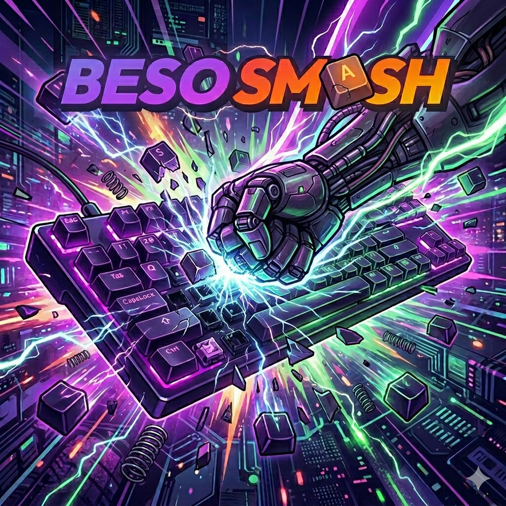

# BeSoSmash

<div align="center">
  
  <br/>
  <h2><a href="https://besosmash.onrender.com/">🎮 Play the Live Version Here! 🎮</a></h2>
</div>

BeSoSmash is a real-time, highly interactive web application that gamifies the act of randomly smashing your keyboard. Built with Node.js, Express, Socket.io, PostgreSQL, and Redis, it turns chaotic typing into a competitive sport complete with leaderboards, global rankings, profile collection, and highly specific, often hilarious personality profiling.

## Screenshots

<div align="center">
  
  
  
</div>

<br/>

## Features

- **Real-Time Keyboard Smashing:** Mashes are sent to the server in real-time via WebSockets and validated asynchronously to ensure no cheating.
- **Multiple Game Modes:**
  - **Classic:** 5 seconds to achieve maximum keystrokes, entropy, and keys-per-second (KPS).
  - **Blitz:** A chaotic 2-second burst mode for ultimate fast fingers.
- **Personality Profiling Engine:** A rule-based engine analyzes keystrokes to generate funny, meme-oriented, and highly judgmental profiles (e.g., "The Script Kiddie", "The Spacebar Supremacist", "The Glitch"). Over 100 unique profiles exist, including Easter Eggs and anti-cheat detections.
- **Profile Collection:** Profiles accumulate across all sessions. Discovering new profiles boosts your score — play different styles to collect them all.
- **Global Leaderboard:** Features search, pagination, stat badges, and live ranking against the global database.
- **Dynamic Scoring (Smash Score):** Total score is calculated using a specialized formula:
  - `(Keys × 1337) + (Entropy² × 1.7) + (KPS × 69) + (Profiles Earned × 420)`
- **Smart Score Saving:** Your high score is never overwritten by a bad run. New profiles discovered on weaker runs still boost your Smash Score using your best stats.
- **Entropy System:** Shannon Entropy measures the randomness and spread of your mashing.
- **Anti-Cheat Validation:** The server detects macros, botting scripts, DOM injection, and hardware spoofing, instantly rejecting illegitimate runs.

## Tech Stack

- **Backend:** Node.js, Express.js
- **Database:** PostgreSQL (Primary Store), Redis (Caching & Sorted Sets)
- **Real-Time Engine:** Socket.io
- **Frontend:** Vanilla JavaScript, EJS (Embedded JavaScript templates), CSS3
- **Dev Tools:** Nodemon, Dotenv

## Installation & Setup

### Prerequisites
- Node.js (v18+ recommended)
- PostgreSQL
- Redis Server (Must be running on default port `6379`)

### Steps

1. **Clone the repository** (or navigate to the directory):
   ```bash
   cd BeSoSmash
   ```

2. **Install dependencies:**
   ```bash
   npm install
   ```

3. **Configure Environment Variables:**
   Create a `.env` file in the root directory (or modify the existing one) with the following variables:
   ```env
   PORT=3000
   PGUSER=your_postgres_user
   PGHOST=localhost
   PGPASSWORD=your_postgres_password
   PGDATABASE=your_postgres_database
   PGPORT=5432
   ```

4. **Ensure PostgreSQL & Redis are running.**
   The server will automatically try to initialize the `scores` table in PostgreSQL on startup.

5. **Start the Application:**

   **Development mode (auto-reload):**
   ```bash
   npm run dev
   ```

   **Production mode:**
   ```bash
   npm start
   ```

6. **Play!**
   Open your browser and navigate to `http://localhost:3000`.

## Detailed Documentation

For a deeper dive into the system's architecture, game modes, and the complex inner workings of the personality inference engine, please refer to the `docs/` folder:

- [System Architecture](docs/ARCHITECTURE.md) — HTTP/WebSocket layers, database design, smart score saving, and project structure.
- [Security Architecture](docs/SECURITY.md) — Anti-cheat layers, rate-limiting, batch frequency validation, and secure score saving.
- [Game Modes](docs/GAME_MODES.md) — Classic vs Blitz, entropy math, and the Smash Score formula.
- [Profile Engine](docs/PROFILE_ENGINE.md) — Rule-based engine architecture, 100+ personality profiles, Easter Eggs, and the profile collection system.
- [Testing Ecosystem](docs/TESTING.md) — Test suites, performance benchmarking, and anti-cheat simulations.

## License

ISC License.
